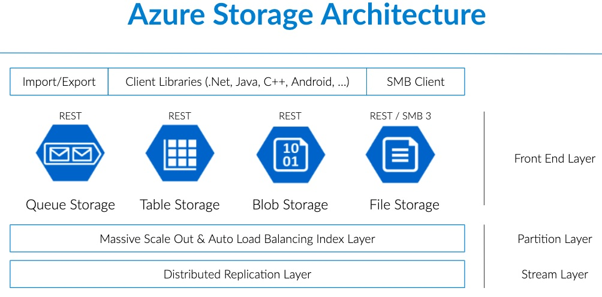
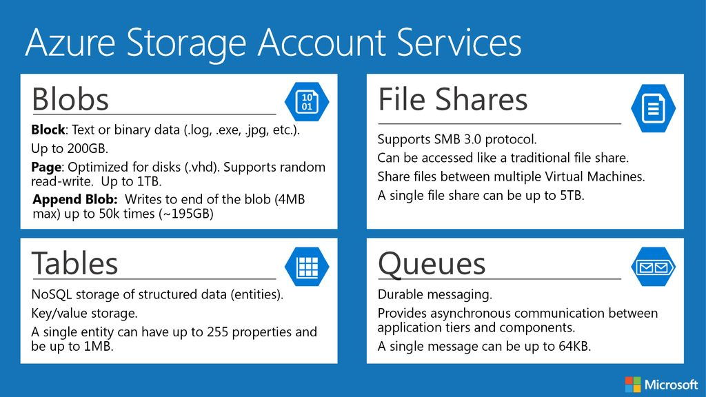

## Azure Storage Architecture



## Storage Choices

- **BLOB**: Unstructured data storage with no schema or data model (also known as object storage).
- **Table Storage**: Structured, NoSQL, key-value store, with up to 500TB capacity.
- **Queue**: Fast, reliable messaging for load balancing.
- **File Service**: Max file size of 5TB, primarily used for VMs, accessible via SMB and REST.
- **CosmosDB**: Microsoft's NoSQL implementation.



### BLOB Storage

Blob storage holds unstructured data that can be read sequentially or randomly as blocks or pages. Each block has an ID, and there can be up to 50,000 blocks per BLOB. It also stores metadata, including an MD5 hash.

- **Dynamic Scaling**: High-traffic blobs can move to dedicated storage nodes. Updates are immediate.
- **Blob Lease**: Manages a lock for write (and delete) operations. Typically lasts 15 seconds; uses the lease API.
- **BLOB Snapshot**: Keeps history or allows for reversion of a BLOB, providing cost-effective versioning of documents.

#### BLOB Types

There are three types of BLOB storage:

1. **Page BLOB** (e.g., VHD):
   - Arbitrary access to any part of the BLOB.
   - Ideal for frequent read/write operations.
   - Sparsely populated; only pay for populated parts.
   - Max size: 1 TB.
   - Commonly used for Azure SQL and VM disks.

2. **Append BLOB**:
   - Can only append to it (no delete or update).
   - WORM (Write Once Read Many) compliant, useful for logging and audit logs.
   - Supports time-based or legal hold retention.

3. **Block BLOB**:
   - Stores unstructured data for fast streaming.
   - Supports sequential access and parallel block uploads.
   - Max size per block: 200GB.
   - Common for general storage and media streaming.

#### Size Limitation

- Overall storage limit: 8TB (to be confirmed).

#### Advantages of BLOB Storage

- Highly scalable (up to 100TB per storage account).
- High availability (99.9% uptime).
- Pay-as-you-go pricing model (PaaS).
- Accessible via REST API.
- Security options, such as access tokens for limited-time access (SAS).

#### Container Storage

- Every BLOB is stored in a container (similar to a root folder).
- Unlimited number of containers allowed.
- Container names must be unique, lowercase, and 3-63 characters in length.
- Supports leases, properties, metadata, and access policies (default is private).

**Storage Hierarchy**:

- **Storage account**: The root level, like a hard drive.
- **Container**: The directory level.
- **BLOB**: Files stored in the container, can simulate directories by adding virtual directories.

### Archive Life cycle Management

Data follows unique life cycles. Early in the life cycle, data is frequently accessed, but over time, access reduces.

Sample rule:

1. Tier BLOB to the cool tier 30 days after the last modification.
2. Tier BLOB to the archive tier 90 days after the last modification.
3. Delete BLOB 2,555 days (seven years) after the last modification.
4. Delete previous versions 90 days after creation.

### BLOB Storage Security

- **Anonymous Public Read-Only Access**: Can allow public access, like content on web pages. The default setting is private.
- BLOBs with the same security requirements should be grouped into the same container.

#### Metadata in BLOB Storage

- System properties (read-only) exist by default.
- User-defined metadata consists of key-value pairs and doesn’t affect the resource's behavior.
- Metadata can be added via the Azure Portal or code (e.g., in .NET).

Example in .NET:

```csharp
blobpic.Metadata.Add("dateuploaded", DateTime.Today.ToString());
blob.SetMetadata();
```

### Shared Access Signature (SAS)

Azure storage items are accessible via HTTP Web API. Access can be restricted using SAS, which appends a signature (a set of query string parameters) to the resource URL.

- SAS Signature: Includes access policy (permissions, time, etc.) and a signature (SHA256 hash).
- Only valid for a specified time, typically 60 minutes.
- Enforces the principle of least knowledge (e.g., read-only or limited access).

#### Creating a SAS Policy

Example in C#:

```csharp
SharedAccessPolicy sap = new SharedAccessPolicy
{
    SharedAccessStartTime = now,
    SharedAccessExpiryTime = now.AddHours(1),
    Permissions = SharedAccessPermissions.Read | SharedAccessPermissions.Write | SharedAccessPermissions.Delete
};

String sas = blob.GetSharedAccessSignature(sap);
```

# Resources

[Blob Storage Intro (ITProTV)](https://www.youtube.com/watch?v=Zm7vPBlq8Wg&ab_channel=ITProTV)
[Intro to Blob, Table, and Queue Storage (Adam Marczak)](https://www.youtube.com/watch?v=UzTtastcBsk&ab_channel=AdamMarczak-AzureforEveryone)
[Getting Started with Blob Storage in .NET Core (Nick Chapsas)](https://www.youtube.com/watch?v=9ZpMpf9dNDA&ab_channel=NickChapsas)
[Blob Storage with CDN and SQL](https://www.youtube.com/watch?v=zRj34VmhUmY&ab_channel=dotnet)
