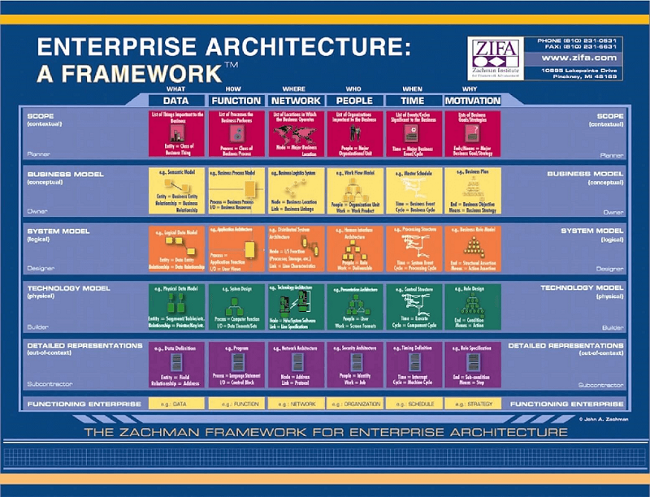
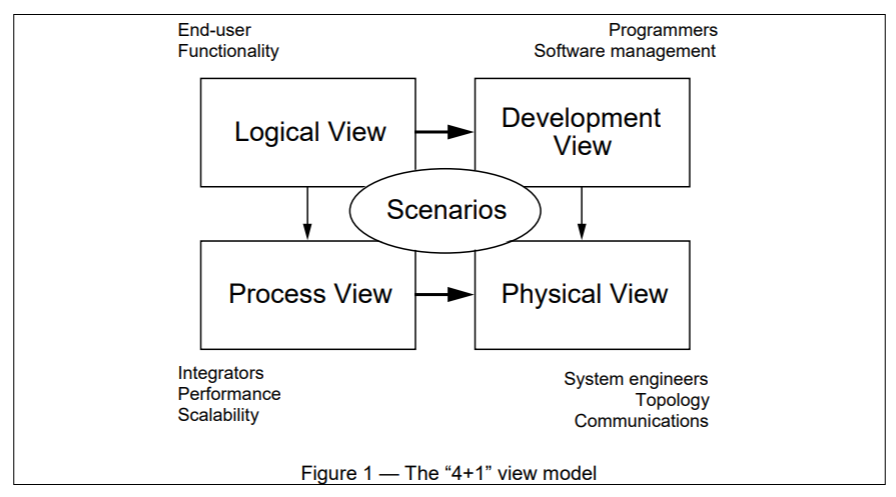
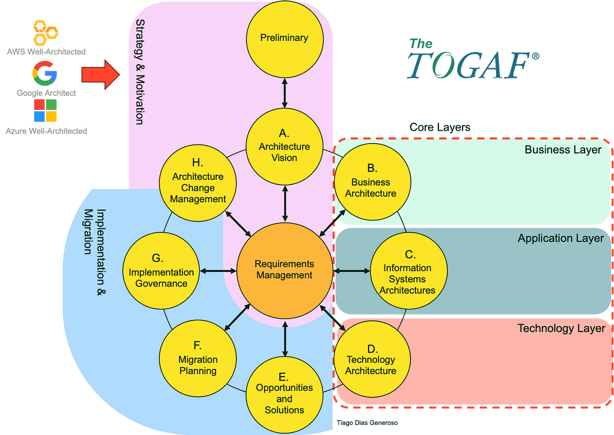
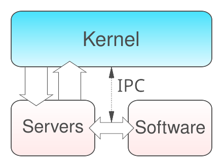
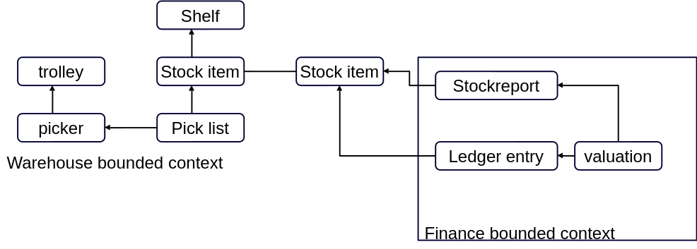

# Recap

- **Difference between application and product**
- **Size**: Divide and conquer
- **Mythical Man-Month**: Not all work can be divided; overhead exists

## Architecture

Architecture is:

- The fundamental organization of a system
- Embodied in its components
- Their relationships to each other and to the environment
- The principles guiding its design and evolution

- **Deals with external complexity**:
  - Stakeholders
- **Deals with internal complexity**:
  - Components, interactions
- **Concerned with non-functionals**

## Frameworks

### Zachman

### Kruchten 4 +1

### TOGAF

## Architecture Solutions

- **Mission/Context**
- **Listing of stakeholders**
- **Description of environment**
- **Requirements**
- **Division of system in components and their interactions**

### Layered Architecture (N-Tier)

Components (code) in this pattern are separated into layers of subtasks and are arranged one above another. Each layer has unique tasks and they are independent of one another. Since each layer is independent, one can modify the code inside a layer without affecting others.

It is the most commonly used pattern for designing the majority of software. This architecture is also known as **N-Tier Architecture**, and generally has 3 layers:

- **Presentation Layer**: The user interface layer where we see and enter data into an application.
- **Business Layer**: Responsible for executing business logic as per the request.
- **Data Layer**: Manages data and the database.

Sometimes extra layers such as the application layer and connection layer exist.

### Client-Server Architecture

The client-server pattern has two major entities:

1. **Server**: Holds resources (data, files, services).
2. **Clients**: Requests resources from the server.

Clients should be thin and have (almost) no state.

**Examples**:

- Email
- WWW
- File sharing apps
- Banking systems

### Pipe and Filter Architecture

A pipeline consists of a chain of processing elements (processes, threads, coroutines, functions, etc.), arranged so that the output of each element is the input of the next. The name is by analogy to a physical pipeline.

- Buffers are usually provided between elements.
- Information flowing is often a stream of records, bytes, or bits.
- The elements in a pipeline may be called filters.
- Connecting elements is analogous to function composition.

### Microkernel Architecture

The microkernel pattern has two major components:

1. **Core System**: Handles the fundamental and minimal operations of the application.
2. **Plug-in Modules**: Handle extended functionalities (like extra features) and customized processing.

Key features: Portability, security, extendability

### Service-Oriented Architecture (SOA)

Focuses on dividing the system by well-defined, network protocol-agnostic interfaces. It includes:

- Asynchronous (message) and synchronous interfaces
- Strong focus on message definition (SOAP messages)
- Clear separation of deployment and building

### Microservices Architecture

Microservices follow similar principles as SOA but emphasize:

- **Self-contained services**: Should be deployable independently.
- **Environment**: Microservices are often facilitated by the cloud.
- **Modifiability**: New features can be added and existing ones modified without affecting other services.
- **Loose coupling**: Modules in microservices are loosely coupled and easily scalable.

#### Requirements of a Microservice:

- Single responsibility
- Independently deployable
- Size consideration
- Information hiding
- Low coupling, high cohesion
- Exposed API → contract
- Owning own state

#### Advantages:

- Technology heterogeneity
- Robustness
- Scalability
- Ease of deployment
- Organizational alignment
- Composability

#### Disadvantages:

- Developer experience
- Technology overload
- Cost
- Reporting
- Monitoring and troubleshooting
- Testing
- Latency
- Data consistency

#### Designing a Microservice:

Uses existing O-O concepts:

- Single responsibility
- Interface segregation
- Data abstraction/hiding
- Domain-driven design
- Bounded contexts
- Ubiquitous language
- Aggregates

### Hexagonal Architecture

The hexagonal architecture, also called **Ports and Adapters**, decouples layers by creating dependency rules where:

- The outer layers depend only on the inner layers.
- Inner layers should not rely on the outer ones.

**Layers**:

- **Infrastructure Layer**: Interfaces with application infrastructure – controllers, UI, persistence, and gateways to external systems.
- **Application Layer**: Provides an API for functionality, accepting commands from the client (web, API, CLI) and delegating responsibility to the domain layer.
- **Domain Layer**: Contains core domain logic, deals with domain concepts, and has no knowledge of the outer layers.

#### Advantages:

- **Maintainability**: Changes in one area don't affect others.
- **Flexibility**: Quickly switch between different applications.
- **Simple testing**: Easily test code in isolation.
- **Agnostic**: Develop the inner core before building external services.

#### Disadvantages:

- Added complexity
- Performance hit
- Debugging can be harder
